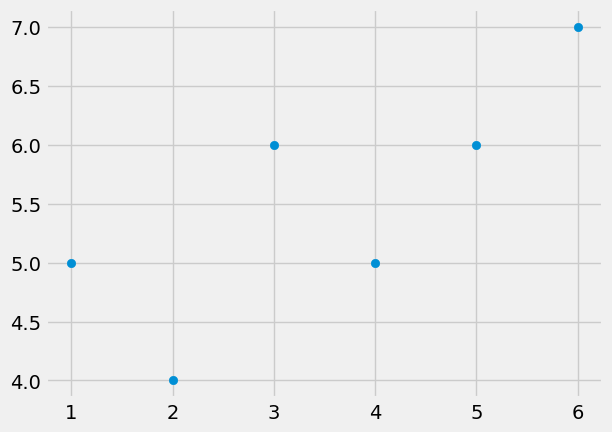
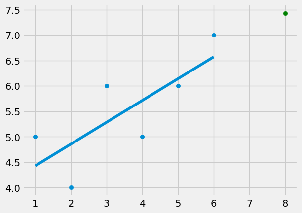

# Linear Regression from Scratch

Obviously, with packages like sklearn, making simple machine learning models, such as linear regressions, by hand is unnecessary. However, I wholeheartedly believe that only using sklearn and other ML APIs and actually knowing the math behind the algorithms completely gets rid of the point of learning ML. So here is an example of Linear Regression from scratch just for learning purposes!


```python
# import necessary libraries
from statistics import mean
import numpy as np
import matplotlib.pyplot as plt
from matplotlib import style
```

Alrighty, making a linear regression from scratch wouldn't mean much if I can't see how it works with some actual data. So let's make some mock data and look at its scatterplot to guesstimate what the best fit line should look like.


```python
# set matplotlib style
style.use('fivethirtyeight')

# make some mock data
xs = np.array([1, 2, 3, 4, 5, 6], dtype = np.float64)
ys = np.array([5, 4, 6, 5, 6, 7], dtype = np.float64)

plt.scatter(xs, ys)
plt.show()
```


    

    


Now let's create the methods needed to calculate not only the best fit line, but the squared error metric and the coefficient of determination.


```python
def best_fit_slope_and_intercept(xs, ys):
    #ahahah pemdas is annoying
    m = ((mean(xs) * mean(ys)) - mean(xs * ys)) / ((mean(xs) ** 2) - mean(xs ** 2))
    b = mean(ys) - m * mean(xs)
    return m, b

def squared_error(ys_orig, ys_line):
    return sum((ys_line - ys_orig) ** 2)

def coefficient_of_determination(ys_orig, ys_line):
    y_mean_line = [mean(ys_orig) for y in ys_orig]
    squared_error_regr = squared_error(ys_orig, ys_line)
    squared_error_y_mean = squared_error(ys_orig, y_mean_line)
    return 1 - (squared_error_regr / squared_error_y_mean)
```


```python
# lets get the best fit line info for the mock data
m, b = best_fit_slope_and_intercept(xs, ys)

print(m, b)
```

    0.42857142857142866 4.0
    

That seems to be right, but let's graph it with our points and see how it looks!


```python
# graph time
regression_line = [(m * x) + b for x in xs]

predict_x = 8
predict_y = (m * predict_x) + b

r_squared = coefficient_of_determination(ys, regression_line)
print(r_squared)

plt.scatter(xs, ys)
plt.scatter(predict_x, predict_y, color='g')
plt.plot(xs, regression_line)
plt.show()
```

    0.5844155844155845
    


    

    

