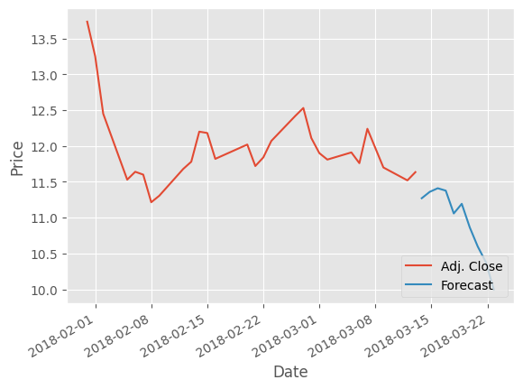

# Linear Regression Stock Predictor

This is a simple application of the basic linear regression model using sklearn.


```python
# import necessary libraries
import quandl, math, datetime
import pandas as pd
import numpy as np
from sklearn import preprocessing, svm
from sklearn.model_selection import train_test_split
from sklearn.linear_model import LinearRegression
import matplotlib.pyplot as plt
from matplotlib import style
```

In this project, I'm using Quandl to get all the historical stock price data for a specified company (in this case AMD) that is available. So let's get that data and then start looking at some of the features in the raw dataset.


```python
# setup graph style and get stock data

style.use('ggplot')
quandl.ApiConfig.api_key = 'EZZ4hjPDPh-Z6EAkQ4sW'

df = quandl.get('WIKI/AMD')

print(df.head())
```

                 Open   High    Low  Close    Volume  Ex-Dividend  Split Ratio  \
    Date                                                                         
    1983-03-21  35.88  36.13  35.25  36.00  127700.0          0.0          1.0   
    1983-03-22  34.88  35.88  34.00  34.00   82000.0          0.0          1.0   
    1983-03-23  34.00  35.25  33.88  34.88  106800.0          0.0          1.0   
    1983-03-24  34.88  35.13  34.63  35.13   98300.0          0.0          1.0   
    1983-03-25  35.63  36.25  35.00  35.50   52600.0          0.0          1.0   
    
                Adj. Open  Adj. High  Adj. Low  Adj. Close  Adj. Volume  
    Date                                                                 
    1983-03-21   8.967543   9.030026  8.810086    8.997535     510800.0  
    1983-03-22   8.717612   8.967543  8.497672    8.497672     328000.0  
    1983-03-23   8.497672   8.810086  8.467680    8.717612     427200.0  
    1983-03-24   8.717612   8.780094  8.655129    8.780094     393200.0  
    1983-03-25   8.905060   9.060018  8.747603    8.872569     210400.0  
    

Looking at the features found in the raw dataset from Quandl, we can see that there are 12 features given. Thinking about what would actually be important in predicting a stock price, we can immediately get rid of the High/Adj. High, Low/ Adj. Low, Volume/Adj. Volume, Ex-Dividend, and Split Ratio features, as they are not the most directly related to how a stock performs.

What would be important for predicting stock prices though? I imagine the closing price and volume of a security would be pretty important. Additionally, I think how much the stock changed and the difference between the high and low of the day would be important. So let's make those features!


```python
#feature engineering

df = df[['Adj. Open', 'Adj. High', 'Adj. Low', 'Adj. Close', 'Adj. Volume', ]]
df["HL_PCT"] = (df['Adj. High'] - df['Adj. Close']) / df['Adj. Close'] * 100.0
df["PCT_change"] = (df['Adj. Close'] - df['Adj. Open']) / df['Adj. Open'] * 100.0

df = df[['Adj. Close', 'HL_PCT', 'PCT_change', 'Adj. Volume']]

print(df.head())
```

                Adj. Close    HL_PCT  PCT_change  Adj. Volume
    Date                                                     
    1983-03-21    8.997535  0.361111    0.334448     510800.0
    1983-03-22    8.497672  5.529412   -2.522936     328000.0
    1983-03-23    8.717612  1.060780    2.588235     427200.0
    1983-03-24    8.780094  0.000000    0.716743     393200.0
    1983-03-25    8.872569  2.112676   -0.364861     210400.0
    

Okay, now that we have our features, let's assign our labels to the different rows. Now of course I can't have the close for the day be the label, otherwise it wouldn't be a predictive model anymore. Instead, I'll shift the prices of the stock up by some constant. This essentially means that the regression model will be trained to predict the stock price some number N days into the future based on the fatures for each day.


```python
# create and assign label

forecast_col = 'Adj. Close'
df.fillna('-99999', inplace=True)

forecast_out = int(math.ceil(0.0011 * len(df)))

df['label'] = df[forecast_col].shift(-forecast_out)


print(df.head())
```

                Adj. Close    HL_PCT  PCT_change  Adj. Volume     label
    Date                                                               
    1983-03-21    8.997535  0.361111    0.334448     510800.0  8.155266
    1983-03-22    8.497672  5.529412   -2.522936     328000.0  7.872843
    1983-03-23    8.717612  1.060780    2.588235     427200.0  7.935326
    1983-03-24    8.780094  0.000000    0.716743     393200.0  8.155266
    1983-03-25    8.872569  2.112676   -0.364861     210400.0  8.405197
    


```python
# create usable dataset

X = np.array(df.drop(columns = 'label'))
X = preprocessing.scale(X)
X_lately = X[-forecast_out:]
X = X[:-forecast_out]
df.dropna(inplace=True)
y = np.array(df['label'])
y = np.array(df['label'])

print(len(X), len(y))
```

    8819 8819
    

Okay, now that we have made a useable datset, let's actually train and test the model!


```python
# train and test the linear regression model

X_train, X_test, y_train, y_test = train_test_split(X ,y, test_size=0.2)

clf = LinearRegression()
clf.fit(X_train, y_train)
accuracy = clf.score(X_test, y_test)

print(accuracy)
print(forecast_out)
```

    0.9539707648073789
    10
    


```python
forecast_set = clf.predict(X_lately)

print(forecast_set, accuracy, forecast_out)
```

    [11.27093988 11.36001604 11.41011529 11.37676308 11.05829547 11.1928784
     10.86314425 10.59568815 10.38107083  9.9978403 ] 0.9539707648073789 10
    

Finally, let's make a stock graph along with our predictions!


```python
# prepare the graph

df['Forecast'] = np.nan

last_date = df.iloc[-1].name
last_unix = last_date.timestamp()
one_day = 86400
next_unix = last_unix + one_day

for i in forecast_set:
    next_date = datetime.datetime.fromtimestamp(next_unix)
    next_unix += one_day
    df.loc[next_date] = [np.nan for _ in range (len(df.columns) - 1)] + [i]
```


```python
# actually graph it

df['Adj. Close'].iloc[8790:].plot()
df['Forecast'].iloc[8790:].plot()
plt.legend(loc=4)
plt.xlabel('Date')
plt.ylabel('Price')
plt.show()
```


    

    

